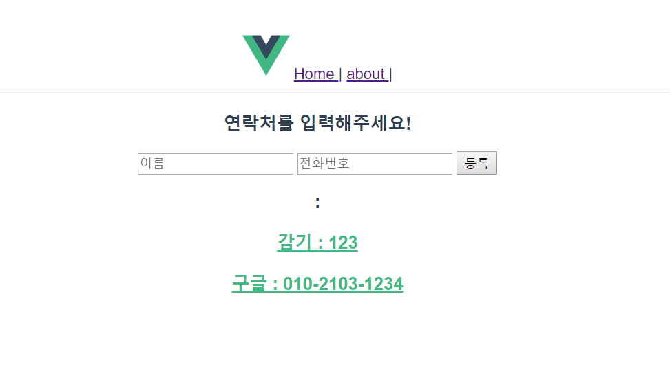

# vue_springboot_ex
vue.js와 Spring boot 연동 예제

## 사용 기술
- Spring boot
- Vue
- rest API (Json형식)
- Axios  (통신을 위함)
- Vue Router (깜빡임 없이 화면 전환, SPA)

## 구현 내용
- 데이터 통신 왔다리 갔다리
- Spring boot 에서 만든 REST API를 읽어와서 Vue.js에 뿌리고
- Vue.js에서 입력한 값들을 Rest에 PUT하고 Spring 콘솔창에 출력하기

  

## 참고 블로그
https://handcoding.tistory.com/196
